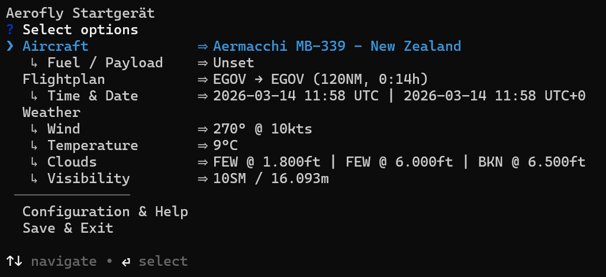

# Aerofly Startgerät

> Giving you more comprehensive options to set-up flights in Aerofly Flight Simulator 4, including import of flight plans and weather.

What does the Aerofly Startgerät do?

- Change aircraft as well as set-up fuel and payload.
- Change weather with settings in feet, statute miles and other meaningful units.
- Change time and date (in UTC or the current departure airport time zone), or syncing the date to the current time and date.
- Import weather for given time, date and departure airport via [Aviation Weather Center API](https://aviationweather.gov/).
- Import a flight plan as well as aircraft, airline, time, date and weather settings from [SimBrief](https://www.simbrief.com/) via API.
- Import a flight plan from flight plan file formats from a local import directory.
- Export a flight plan to a local export directory for later re-import.

Supported flight plan file formats for import:

- Aerofly FS `mcf`
- Garmin `fpl`
- Microsoft Flight Simulator `pln`
- X-Plane `fms`

Supported flight plan file formats for export:

- Aerofly FS `tmc` and `mcf`

In this manner the Aerofly Startgerät combines the capabilities of the [Aerofly Wettergerät](https://github.com/fboes/aerofly-wettergeraet) (but for multiple operating systems) and the [Aerofly Missionsgerät](https://github.com/fboes/aerofly-missions) (but directly injecting the new flight plan without any extra steps in-between).

## Requirements

This tool requires [Node.js](https://nodejs.org/en) in at least version 20 to be installed on your local computer.

1. Visit [nodejs.org](https://nodejs.org/en)
2. Download the LTS (Long Term Support) version
3. Run the installer and follow the setup wizard
4. Open your terminal application and verify the correct installation: `node --version`

Be aware that this is only feasible on computers running Microsoft Windows, Apple OSX and Linux.

The Aerofly Startgerät is a Command Line Interface (CLI) tool, which means you need to open a terminal to run it. The tool itself does not need to be installed, as the Node.js tool `npx` will take care of downloading as well as executing the Aerofly Startgerät.

## Installation

No installation is required! The Aerofly Startgerät runs directly via `npx` installed alongside `node`, which automatically downloads and executes the latest version.

Call this tool by opening the pre-installed terminal application of your computer and execute this command:

```bash
npx @fboes/aerofly-startgeraet@latest
```

This will automatically download the latest version of this application and show the main menu of the Aerofly Startgerät.

### Windows: Add as shortcut

For convenience you may want to add a desktop shortcut:

1. Right click on your desktop
1. Select "Create Shortcut"
1. Set `npx` as location
1. Right click on new desktop icon to append `@fboes/aerofly-startgeraet@latest` to "Target".
1. You may also want to rename the shortcut to "Aerofly Startgerät" and select a nice icon.

## Usage

Call this tool by opening the pre-installed terminal application of your computer and execute this command:

```bash
npx @fboes/aerofly-startgeraet@latest
```

> [!WARNING]
> Aerofly FS 4 must not be started while using the Aerofly Startgerät. Settings generated by the Aerofly Startgerät will only be read by Aerofly FS 4 on start-up of the simulator.

This will automatically download the latest version of this application and show the main menu of the Aerofly Startgerät.



On start-up this will load the current settings of Aerofly FS 4 by inspecting the `main.mcf` configuration file. If the file cannot be found automatically, the Aerofly Startgerät will ask for its location.

On a successful start-up, you will see a text menu. To select an option, use the arrow keys and press enter.

On exiting the Aerofly Startgerät, your changes will be saved back to the `main.mcf` and will be available on starting Aerofly FS 4 the next time.

> [!WARNING]
> The Aerofly Startgerät may break your `main.mcf`. Be sure to have a backup of this file.

See the [Aerofly Startgerät CLI Menu Manual](./docs/cli-menu.md) for details.

### Short-hand CLI commands

There are also short-hand CLI commands which solve a single task without any user interaction:

```bash
# Import SimBrief flightplan
npx @fboes/aerofly-startgeraet@latest simbrief

# Import METAR weather for current depsrture airport & time
npx @fboes/aerofly-startgeraet@latest metar

# Set time to current time
npx @fboes/aerofly-startgeraet@latest time
```

### Caveats and notes

1. Importing flight plans almost certainly will require to set-up the starting location of you aircraft in Aerofly FS 4, as the parking positions of aircraft are unknown.
1. Importing flight plans almost certainly will require to set-up the runways you want to use in Aerofly FS 4, as the runway IDs are unknown.
1. Importing of SIDs and STARs is not possible, so you will also need to add these manually in Aerofly FS 4.
1. The Aerofly Startgerät is able to alter the date and a third cloud layer, which both are not editable in Aerofly FS 4.
1. The mapping of aircrafts & airlines from Simbrief import relies on the correct ICAO code of the aircraft being chosen.

## Technical stuff

This projects uses the public APIs of the [Aviation Weather Center](https://aviationweather.gov/) and [SimBrief](https://www.simbrief.com/). The usage of these APIs may be restricted or blocked on your local computer.

## Status

[](https://github.com/fboes/aerofly-startgeraet)
[](https://www.npmjs.com/package/@fboes/aerofly-startgeraet)


For a detailed history of changes, see [CHANGELOG.md](CHANGELOG.md).

## Legal stuff

Author: [Frank Boës](https://3960.org/) 2026

Copyright & license: See [LICENSE.txt](LICENSE.txt)

This tool is NOT affiliated with, endorsed, or sponsored by IPACS GbR. As stated in the [LICENSE.txt](LICENSE.txt), this tool comes with no warranty and might damage your files.

This software complies with the General Data Protection Regulation (GDPR) as it does not collect nor transmits any personal data to third parties, but for the usage of the [Aviation Weather Center API](https://aviationweather.gov/) and the [SimBrief API](https://www.simbrief.com/). For their data protection statement you might want to check their terms of service.
