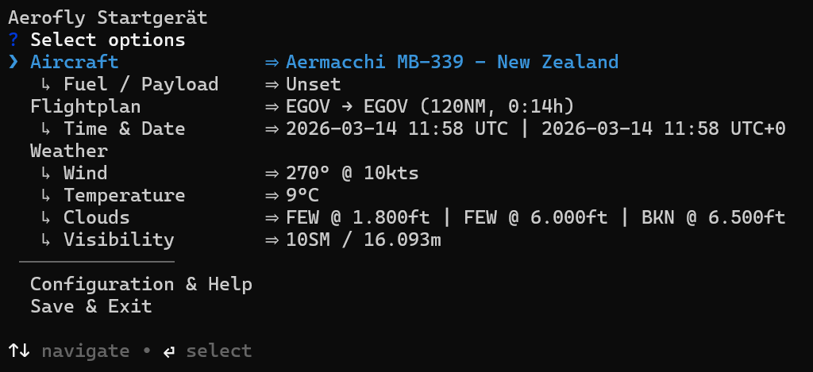

#  Aerofly Startgerät - CLI Tool



## Requirements

This application supports computers running Microsoft Windows, Apple macOS and Linux.

The Aerofly Startgerät is a Command Line Interface (CLI) tool, which means you need to open a terminal to run it.

## Installation

There are two installation options:

1. Installation via Node.js / NPM (recommended, auto-updating)
2. Installation as executable file

### 1. Installation via Node.js / NPM

This installation method requires [Node.js](https://nodejs.org/en) in at least version 20 to be installed on your local computer.

1. Visit [nodejs.org](https://nodejs.org/en)
2. Download the LTS (Long Term Support) version
3. Run the installer and follow the setup wizard
4. Open your terminal application and verify the correct installation: `node --version`

The Aerofly Startgerät runs directly via `npx` installed alongside `node`, which automatically downloads and executes the latest version.

Call this tool by opening the pre-installed terminal application of your computer and execute this command:

```bash
npx @fboes/aerofly-startgeraet@latest
```

This will automatically download the latest version of this application and show the main menu of the Aerofly Startgerät.

### 2. Installation as executable file

If you do not want to have Node.js installed, you can also download a pre-compiled version of this tool, which runs on our local machine.

1. Download the latest Aerofly Startgerät CLI tool from the Github releases at https://github.com/fboes/aerofly-startgeraet/releases/latest.
2. Move the Aerofly Startgerät CLI tool to a sensible location and mark it as executable (see below).
3. Start the Aerofly Startgerät CLI tool (see below).

#### Linux / macOS

After downloading, mark the file as executable:

```bash
# Linux
chmod +x aerofly-startgeraet-cli-linux
# or on macOS - Silicon chip
chmod +x aerofly-startgeraet-cli-macos-arm64
# or on macOS - Intel chip
chmod +x aerofly-startgeraet-cli-macos-x64
```

Then run it:

```bash
# Linux
./aerofly-startgeraet-cli-linux
# or on macOS - Silicon chip
./aerofly-startgeraet-cli-macos-arm64
# or on macOS - Intel chip
./aerofly-startgeraet-cli-macos-x64
```

#### macOS Gatekeeper

macOS may block the file as it is from an unidentified developer. To allow it:

```bash
xattr -dr com.apple.quarantine aerofly-startgeraet-cli-macos-arm64
```

Or via **System Settings → Privacy & Security → Allow anyway**.

#### Windows

Simply double-click `aerofly-startgeraet-cli-windows.exe` or run it in PowerShell:

```powershell
.\aerofly-startgeraet-cli-windows.exe
```

For convenience you may want to add a desktop shortcut:

1. Right click on th the application
2. Select "Create Shortcut"
3. Drag the shortcut to your desktop

## Usage

Call this tool by opening the pre-installed terminal application of your computer and execute the command matching you installation method.

> [!WARNING]
> Aerofly FS 4 must not be started while using the Aerofly Startgerät. Settings generated by the Aerofly Startgerät will only be read by Aerofly FS 4 on start-up of the simulator.

This will show the main menu of the Aerofly Startgerät.


On start-up this will load the current settings of Aerofly FS 4 by inspecting the `main.mcf` configuration file. If the file cannot be found automatically, the Aerofly Startgerät will ask for its location.

On a successful start-up, you will see a text menu. To select an option, use the arrow keys and press enter.

On exiting the Aerofly Startgerät, your changes will be saved back to the `main.mcf` and will be available on starting Aerofly FS 4 the next time.

> [!WARNING]
> The Aerofly Startgerät may break your `main.mcf`. Be sure to have a backup of this file.

### Short-hand CLI commands

There are also short-hand CLI commands which solve a single task without any user interaction:

```bash
# Import current SimBrief flightplan
[YOUR START COMMAND] simbrief

# Import METAR weather for current departure airport , time & date
[YOUR START COMMAND] metar

# Set simulator time & date to current time & date
[YOUR START COMMAND] time
```

---

[Back to top](../README.md)
