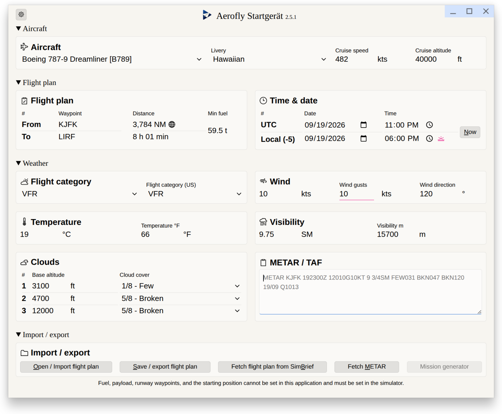

#  Aerofly Startgerät - GUI App



## Requirements

This application supports computers running Microsoft Windows, Apple macOS and Linux. For Linux a Debian installer as well as an AppImage is provided, which should run on most versions of Linux.

## Installation

1. Download the latest Aerofly Startgerät GUI app from the Github releases at https://github.com/fboes/aerofly-startgeraet/releases/latest.
2. Double-click the downloaded installer to set-up the application on your system (see below).
3. Start the Aerofly Startgerät GUI app (see below).

### macOS Gatekeeper

macOS may block the file as it is from an unidentified developer. To allow it:

```bash
xattr -dr com.apple.quarantine aerofly-startgeraet-gui-macos
```

Or via **System Settings → Privacy & Security → Allow anyway**.

## Usage

Call this tool by double-clicking the GUI app. On a successful start-up, you will see the main app window.

> [!WARNING]
> The Aerofly Startgerät may break your `main.mcf`. Be sure to have a backup of this file.


On start-up this will load the current settings of Aerofly FS 4 by inspecting the `main.mcf` configuration file. If the file cannot be found automatically, the Aerofly Startgerät will ask for its location.

On changing settings in the Aerofly Startgerät, these settings will be written (with a slight delay) to the `main.mcf`. On closing the application, the `main.mcf` gets updated with the settings from the Aerofly Startgerät in any case.

---

[Back to top](../README.md)
