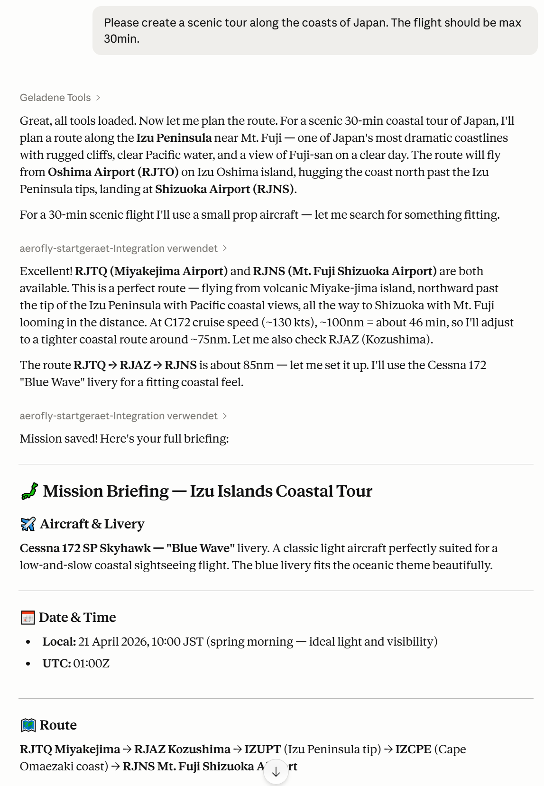

#  Aerofly Startgerät - MCP Server

The Aerofly Startgerät MCP server acts as an interface usable by local AI clients to set up flight plans as well as other flight parameters in Aerofly FS 4.

The Aerofly Startgerät MCP server is available as a pre-packaged MCPB file (which can be used with Claude Desktop), as a stand-alone Node.js application to use with any other local AI tool which can access a local MCP server, or as a stand-alone apllication which does not require Node.js but needs to be available for your operating system.



## Installation

There are multiple installation options:

1. Installation via MCPB file (recommended for all clients capable of using MCPB files)
2. Installation via Node.js / NPM (recommended, auto-updating)
3. Installation as executable file

### 1. Installation via MCPB file

1. Be sure to have a local AI client installed which can import MCPB files.
2. Download the latest MCPB file from the Github releases at [https://github.com/fboes/aerofly-startgeraet/releases/](https://github.com/fboes/aerofly-startgeraet/releases/latest).
3. Install the MCPB file by double-clicking the it.

### 2. Installation via Node.js / NPM

This installation method requires [Node.js](https://nodejs.org/en) in at least version 20 to be installed on your local computer.

1. Visit [nodejs.org](https://nodejs.org/en)
2. Download the LTS (Long Term Support) version
3. Run the installer and follow the setup wizard
4. Open your terminal application and verify the correct installation: `node --version`

The Aerofly Startgerät runs directly via `npx` installed alongside `node`, which automatically downloads and executes the latest version.

Call this tool by opening the pre-installed terminal application of your computer and execute this command:

```bash
npx @fboes/aerofly-startgeraet@latest aerofly-startgeraet-mcp
```

This will automatically download the latest version of this application and show the main menu of the Aerofly Startgerät.

### 3. Installation as executable file

If you do not want to have Node.js installed, you can also download a pre-compiled version of this tool, which runs on our local machine.

1. Download the latest Aerofly Startgerät CLI tool from the Github releases at [https://github.com/fboes/aerofly-startgeraet/releases/](https://github.com/fboes/aerofly-startgeraet/releases/latest).
2. Move the Aerofly Startgerät CLI tool to a sensible location and mark it as executable (see below).
3. Start the Aerofly Startgerät CLI tool (see below).

#### Linux / macOS

After downloading, mark the file as executable:

```bash
# Linux
chmod +x aerofly-startgeraet-mcp-linux
# or on macOS - Silicon chip
chmod +x aerofly-startgeraet-mcp-macos-arm64
# or on macOS - Intel chip
chmod +x aerofly-startgeraet-mcp-macos-x64
```

Then run it:

```bash
# Linux
./aerofly-startgeraet-mcp-linux
# or on macOS - Silicon chip
./aerofly-startgeraet-mcp-macos-arm64
# or on macOS - Intel chip
./aerofly-startgeraet-mcp-macos-x64
```

#### macOS Gatekeeper

macOS may block the file as it is from an unidentified developer. To allow it:

```bash
xattr -dr com.apple.quarantine aerofly-startgeraet-mcp-macos-arm64
```

Or via **System Settings → Privacy & Security → Allow anyway**.

#### Windows

Simply double-click `aerofly-startgeraet-mcp-windows.exe` or run it in PowerShell:

```powershell
.\aerofly-startgeraet-mcp-windows.exe
```

For convenience you may want to add a desktop shortcut:

1. Right click on th the application
2. Select "Create Shortcut"
3. Drag the shortcut to your desktop

## Usage

After the MCP server has been registered with your local AI client, prompting the AI to build a flightplan for Aerofly FS 4 should automatically let the AI decide to use the MCP server and its capabilities.

> [!WARNING]
> Aerofly FS 4 must not be started while using the Aerofly Startgerät MCP server. Settings generated by the Aerofly Startgerät MCP server will only be read by Aerofly FS 4 on start-up of the simulator.

The MCP server offers:

- A resource with a list of all aircraft of Aerofly FS 4, as well as a search tool
- A resource with a list of all airports of Aerofly FS 4, as well as a search tool
- A tool to set the time & weather
- A tool to import live METAR weather
- A tool to set the aircraft, livery, fuel and payload
- A tool to import a SimBrief flight plan
- A tool to create a completely new flight plan
- A tool to save all of these changes to Aerofly FS 4

> [!WARNING]
> The Aerofly Startgerät MCP server may break your `main.mcf`. Be sure to have a backup of this file.

### Note on token usage

Once an MCP server is added to a local AI client, its tool definitions are loaded into every conversation — including ones where you don't use the server at all. This increases your input token consumption per request and reduces the context window available for your actual conversation.

> [!WARNING]
> To avoid unnecessary overhead, remove MCP servers you don't regularly need.

---

[Back to top](../README.md)
